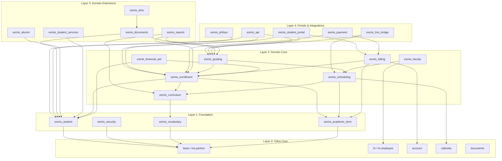
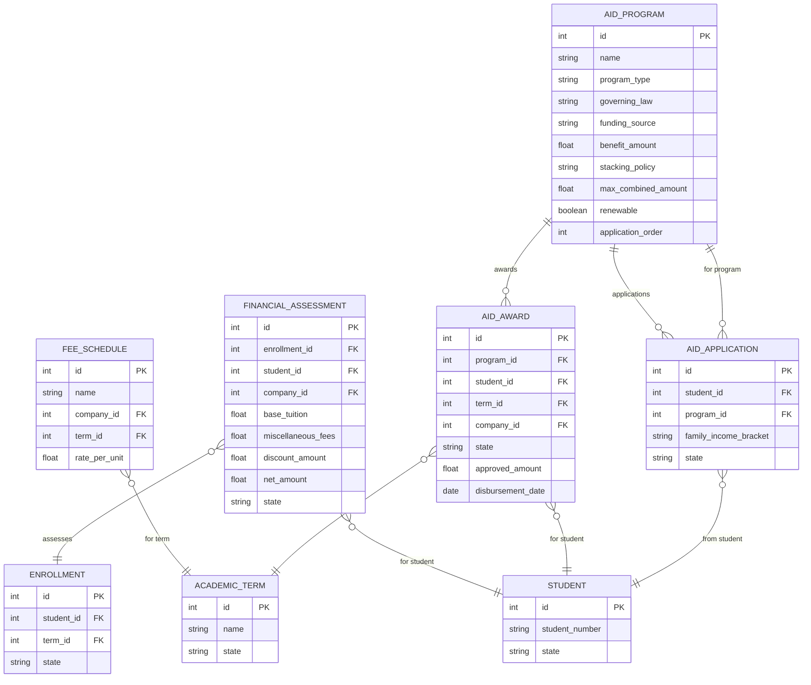
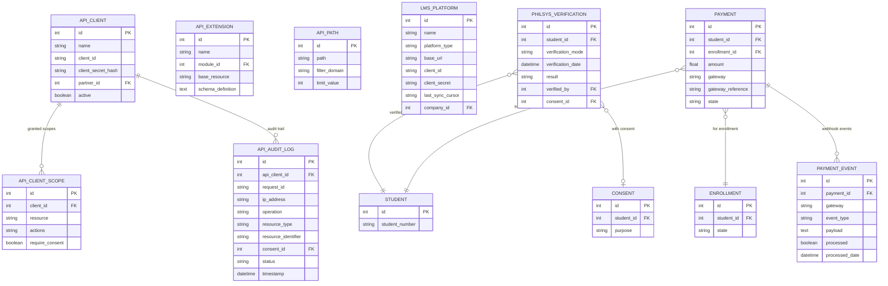

# Entity-Relationship Diagrams

Visual ERDs for the eSMIS data model, organized by architecture layer. Each diagram
focuses on a subset of the 81 models to remain readable. For complete field listings,
see [Data Model Registry](data-model-registry.md).

**Last Updated:** 2026-03-09

---

## Table of Contents

1. [High-Level Module Relationships](#1-high-level-module-relationships)
2. [Foundation Layer ERD (Layer 1)](#2-foundation-layer-erd-layer-1)
3. [Academic Core ERD (Layer 2)](#3-academic-core-erd-layer-2)
4. [Financial Core ERD (Layer 2)](#4-financial-core-erd-layer-2)
5. [Extended Services ERD (Layer 3)](#5-extended-services-erd-layer-3)
6. [Portals and Integrations ERD (Layer 4)](#6-portals-and-integrations-erd-layer-4)
7. [Cross-Cutting Models ERD](#7-cross-cutting-models-erd)

---

## 1. High-Level Module Relationships

How the 19 eSMIS modules relate across the four architecture layers. Dependencies flow
downward: higher layers depend on lower layers, never the reverse.

---

## 2. Foundation Layer ERD (Layer 1)

Layer 1 contains 19 models across four modules: `esmis_vocabulary` (terminology),
`esmis_security` (audit, privacy, consent, approval), `esmis_student` (student profile,
identifiers, course history), and `esmis_academic_term` (academic year and term definitions).

Privacy and compliance models (`esmis.consent`, `esmis.data.breach`,
`esmis.data.subject.request`, `esmis.disposal.review`, `esmis.retention.schedule`,
`esmis.consent.scope`) belong to `esmis_security`.

```mermaid
erDiagram
    VOCABULARY ||--o{ VOCABULARY_CODE : "has codes"
    VOCABULARY_CODE ||--o{ VOCABULARY_MAPPING : "maps from"
    VOCABULARY_CODE }o--o| VOCABULARY_CODE : "parent of"

    VOCABULARY {
        int id PK
        string name
        string namespace_uri
        string version
        string domain
        boolean is_system
        boolean is_hierarchical
    }

    VOCABULARY_CODE {
        int id PK
        int vocabulary_id FK
        string code
        string display
        int sequence
        int parent_id FK
        boolean deprecated
    }

    VOCABULARY_MAPPING {
        int id PK
        int source_id FK
        int target_id FK
        string equivalence
    }

    STUDENT ||--|| RES_PARTNER : "linked to"
    STUDENT }o--o| PROGRAM : "enrolled in"
    STUDENT }o--o| CURRICULUM : "bound to"
    STUDENT }o--o| RES_PARTNER : "guardian"
    STUDENT ||--o{ STUDENT_PROGRAM : "program enrollments"
    STUDENT ||--o{ STUDENT_COURSE_HISTORY : "course history"
    STUDENT ||--o{ CONSENT : "gives consent"
    STUDENT ||--o{ DATA_SUBJECT_REQUEST : "submits requests"

    RES_PARTNER ||--o{ IDENTIFIER : "has identifiers"

    STUDENT {
        int id PK
        int partner_id FK
        string student_number
        int company_id FK
        string state
        int program_id FK
        int curriculum_id FK
        int year_level
        float gwa
        string academic_standing
        int guardian_id FK
    }

    STUDENT_PROGRAM {
        int id PK
        int student_id FK
        int program_id FK
        int curriculum_id FK
        float cumulative_gwa
        string academic_standing
    }

    STUDENT_COURSE_HISTORY {
        int id PK
        int student_id FK
        int course_id FK
        int grade_id FK
        int term_id FK
        boolean is_passed
    }

    IDENTIFIER {
        int id PK
        int partner_id FK
        int type_id FK
        string value
        binary value_ciphertext
        string value_blind_index
    }

    RES_PARTNER {
        int id PK
        string name
        string email
    }

    ACADEMIC_YEAR ||--o{ ACADEMIC_TERM : "contains terms"

    ACADEMIC_YEAR {
        int id PK
        string name
        date date_start
        date date_end
    }

    ACADEMIC_TERM {
        int id PK
        int academic_year_id FK
        int company_id FK
        string name
        date date_start
        date date_end
        date add_drop_deadline
        string state
    }

    AUDIT_RULE ||--o{ AUDIT_LOG : "generates"

    AUDIT_RULE {
        int id PK
        string name
        int model_id FK
        boolean log_create
        boolean log_write
        boolean log_unlink
    }

    AUDIT_LOG {
        int id PK
        int audit_rule_id FK
        int user_id FK
        int model_id FK
        int res_id
        string method
        text data
    }

    PII_ACCESS_LOG {
        int id PK
        int user_id FK
        string model
        int res_id
        string field_name
        string access_type
        string ip_address
    }

    APPROVAL_DEFINITION {
        int id PK
        string name
        int model_id FK
    }

    CONSENT ||--o{ CONSENT_SCOPE : "scoped to"

    CONSENT {
        int id PK
        int student_id FK
        string purpose
        string lawful_basis
        datetime date_given
        datetime date_withdrawn
        string evidence_type
        boolean parent_consent
    }

    CONSENT_SCOPE {
        int id PK
        int consent_id FK
        string resource_type
        string purpose
        int third_party_id FK
        date valid_until
    }

    DATA_SUBJECT_REQUEST {
        int id PK
        int student_id FK
        string request_type
        date receipt_date
        date deadline
        string state
        int dpo_id FK
    }

    DATA_BREACH {
        int id PK
        string name
        datetime discovery_date
        datetime npc_deadline
        int affected_count
        string severity
        boolean npc_notified
        int dpo_id FK
    }

    DISPOSAL_REVIEW {
        int id PK
        string state
        string data_type
        int record_count
        string proposed_action
        int dpo_approved_by FK
    }

    RETENTION_SCHEDULE {
        int id PK
        string data_type
        int model_id FK
        int retention_period_years
        string action_at_expiry
        string legal_basis
        boolean is_permanent
    }
```

---

## 3. Academic Core ERD (Layer 2)

Layer 2 academic models span five modules: `esmis_curriculum` (programs, courses,
curriculum plans, PQF mappings), `esmis_enrollment` (enrollment lifecycle, admissions,
add/drop, cross-enrollment), `esmis_grading` (grading systems, grade entry, GWA,
grade changes, honors), `esmis_scheduling` (sections, rooms, schedules), and
`esmis_faculty` (faculty teaching loads).

```mermaid
erDiagram
    COLLEGE ||--o{ PROGRAM : "offers"
    PROGRAM ||--o{ CURRICULUM : "has versions"
    PROGRAM ||--o| PQF_MAPPING : "mapped to PQF"
    PROGRAM ||--o| STANDING_POLICY : "retention rules"
    CURRICULUM }o--o{ COURSE : "includes courses"
    COURSE }o--o{ COURSE : "prerequisites"

    COLLEGE {
        int id PK
        string name
        int company_id FK
    }

    PROGRAM {
        int id PK
        string name
        string code
        int degree_type FK
        int pqf_level
        int college_id FK
        int grading_system_id FK
    }

    CURRICULUM {
        int id PK
        string name
        int program_id FK
        string version
        string effective_year
        float total_units
        float elective_units
        float residency_units
    }

    COURSE {
        int id PK
        string name
        string code
        float units
        text description
    }

    PQF_MAPPING {
        int id PK
        int program_id FK
        int pqf_level
        string qualification_title
    }

    APPLICANT ||--o| ADMISSION_DECISION : "receives decision"
    APPLICANT }o--o| STUDENT : "becomes student"
    APPLICANT }o--|| PROGRAM : "applies to"
    APPLICANT }o--|| RES_PARTNER : "contact"

    APPLICANT {
        int id PK
        int partner_id FK
        int company_id FK
        int student_id FK
        int program_id FK
        string state
        string lrn
        boolean philsys_verified
    }

    ADMISSION_DECISION {
        int id PK
        int applicant_id FK
        string decision
        text conditions
        date resolution_deadline
        int decided_by FK
    }

    ENROLLMENT ||--o{ ENROLLMENT_LINE : "course selections"
    ENROLLMENT ||--o{ ENROLLMENT_CHANGE : "add/drop changes"
    ENROLLMENT }o--|| STUDENT : "for student"
    ENROLLMENT }o--|| ACADEMIC_TERM : "in term"

    ENROLLMENT {
        int id PK
        int student_id FK
        int term_id FK
        int company_id FK
        string state
        boolean is_cross_enrolled
    }

    ENROLLMENT_LINE }o--|| SECTION : "in section"
    ENROLLMENT_LINE }o--|| COURSE : "for course"

    ENROLLMENT_LINE {
        int id PK
        int enrollment_id FK
        int section_id FK
        int course_id FK
        float units
        string state
    }

    ENROLLMENT_CHANGE {
        int id PK
        int enrollment_id FK
        string change_type
        int section_id FK
        float refund_amount
    }

    ENROLLMENT_HOLD }o--|| STUDENT : "blocks"

    ENROLLMENT_HOLD {
        int id PK
        int student_id FK
        string hold_type
        boolean is_active
        int placed_by FK
    }

    ENROLLMENT_WINDOW }o--|| ACADEMIC_TERM : "for term"

    ENROLLMENT_WINDOW {
        int id PK
        int term_id FK
        int company_id FK
        string priority_group
        datetime date_start
        datetime date_end
    }

    CROSS_ENROLLMENT_PERMIT }o--|| STUDENT : "for student"
    CROSS_ENROLLMENT_PERMIT }o--|| SECTION : "target section"

    CROSS_ENROLLMENT_PERMIT {
        int id PK
        int student_id FK
        int home_company_id FK
        int host_company_id FK
        int section_id FK
        string state
    }

    CREDIT_TRANSFER }o--|| STUDENT : "for student"

    CREDIT_TRANSFER {
        int id PK
        int company_id FK
        int source_company_id FK
        int student_id FK
        float evaluated_units
        float approved_units
        string state
    }

    SECTION }o--|| COURSE : "teaches"
    SECTION }o--|| ACADEMIC_TERM : "in term"
    SECTION }o--o| ROOM : "in room"
    SECTION }o--o| HR_EMPLOYEE : "taught by"
    SECTION }o--o| GRADING_SYSTEM : "graded by"

    SECTION {
        int id PK
        string name
        int course_id FK
        int term_id FK
        int company_id FK
        int room_id FK
        int faculty_id FK
        int capacity
        string learning_modality
    }

    ROOM {
        int id PK
        string name
        int company_id FK
        int capacity
        string building
        string floor
    }

    GRADING_SYSTEM ||--o{ GRADING_SCALE : "scale entries"

    GRADING_SYSTEM {
        int id PK
        string name
        string scale_direction
        float passing_threshold
        boolean gpa_equivalent_enabled
    }

    GRADING_SCALE {
        int id PK
        int grading_system_id FK
        float numeric_value
        string label
        float gpa_equivalent
        boolean is_passing
        boolean is_incomplete
    }

    GRADE }o--|| STUDENT : "for student"
    GRADE }o--|| SECTION : "in section"
    GRADE }o--o| ENROLLMENT_LINE : "from enrollment"
    GRADE ||--o{ GRADE_COMPONENT : "components"
    GRADE ||--o| GRADE_CHANGE : "change request"

    GRADE {
        int id PK
        int student_id FK
        int section_id FK
        int enrollment_line_id FK
        string state
        float final_grade
        float numeric_value
        float units
        boolean is_incomplete
        boolean is_dropped
        string source
    }

    GRADE_COMPONENT {
        int id PK
        int grade_id FK
        string component_type
        float weight
        float raw_score
        float weighted_score
    }

    GRADE_COMPONENT_TEMPLATE {
        int id PK
        string name
    }

    GRADE_CHANGE {
        int id PK
        int original_grade_id FK
        int requested_by FK
        float old_grade_value
        float new_grade_value
        text reason
        string state
        int dean_approved_by FK
        int registrar_locked_by FK
    }

    STANDING_POLICY }o--|| PROGRAM : "for program"

    STANDING_POLICY {
        int id PK
        int program_id FK
        float retention_threshold
        float warning_threshold
        float deans_list_threshold
        int company_id FK
    }

    LATIN_HONORS_CONFIG {
        int id PK
        string honors_level
        float min_gwa
        float max_gwa
        float min_units_completed
        boolean no_failing_grade_required
    }

    FACULTY_LOAD }o--|| HR_EMPLOYEE : "for faculty"
    FACULTY_LOAD }o--|| ACADEMIC_TERM : "in term"
    FACULTY_LOAD }o--o{ SECTION : "assigned sections"

    FACULTY_LOAD {
        int id PK
        int employee_id FK
        int company_id FK
        int term_id FK
        float total_units
    }

    HR_EMPLOYEE {
        int id PK
        string name
    }
```

---

## 4. Financial Core ERD (Layer 2)

Layer 2 financial models span two modules: `esmis_billing` (fee schedules, financial
assessment, payment tracking) and `esmis_financial_aid` (aid programs, eligibility,
awards, discount stacking per RA 10931/RA 10687).

---

## 5. Extended Services ERD (Layer 3)

Layer 3 contains 16 models across four modules plus DMS: `esmis_documents` (TOR/diploma
generation, eCAV export, graduation, clearance), `esmis_reports` (HEMIS export wizards),
`esmis_alumni` (tracer studies), `esmis_student_services` (health, counseling,
disciplinary records), and `esmis_dms` (document management storage).

```mermaid
erDiagram
    DOCUMENT }o--|| STUDENT : "belongs to"
    DOCUMENT }o--o| DIGITAL_SIGNATURE : "signed by"

    DOCUMENT {
        int id PK
        string name
        int student_id FK
        string document_type
        int generated_by FK
        datetime generated_date
        string qr_token
        int digital_signature_id FK
    }

    DOCUMENT_REQUEST }o--|| STUDENT : "requested by"

    DOCUMENT_REQUEST {
        int id PK
        int student_id FK
        string document_type
        text purpose
        string state
        boolean payment_required
    }

    DIGITAL_SIGNATURE {
        int id PK
        string name
        int user_id FK
        binary signature_image
    }

    GRADUATION }o--|| STUDENT : "graduate"
    GRADUATION }o--|| PROGRAM : "from program"
    GRADUATION }o--o| CLEARANCE : "cleared by"

    GRADUATION {
        int id PK
        int student_id FK
        int program_id FK
        date graduation_date
        string honors_level
        string special_order_number
        int clearance_id FK
        string state
    }

    GRADUATION_POLICY }o--|| PROGRAM : "for program"
    GRADUATION_POLICY ||--o{ LATIN_HONORS_CONFIG : "honors thresholds"

    GRADUATION_POLICY {
        int id PK
        int program_id FK
        float min_gwa
    }

    CLEARANCE ||--o{ CLEARANCE_LINE : "office clearances"
    CLEARANCE }o--|| STUDENT : "for student"

    CLEARANCE {
        int id PK
        int student_id FK
        string state
    }

    CLEARANCE_LINE {
        int id PK
        int clearance_id FK
        string office
        boolean is_cleared
        int cleared_by FK
        datetime cleared_date
    }

    HEMIS_EXPORT_WIZARD {
        int id PK
        int academic_year_id FK
        string institution_type
        int company_id FK
    }

    TRACER_RESPONSE }o--|| STUDENT : "alumnus"

    TRACER_RESPONSE {
        int id PK
        int student_id FK
        date survey_date
        string employment_status
        string employer_name
        string job_title
        boolean is_degree_related
        int months_to_first_job
    }

    HEALTH_RECORD }o--|| STUDENT : "for student"

    HEALTH_RECORD {
        int id PK
        int student_id FK
        string disability_status
        text medical_notes
        text immunization_records
    }

    COUNSELING_NOTE }o--|| STUDENT : "for student"

    COUNSELING_NOTE {
        int id PK
        int student_id FK
        int counselor_id FK
        datetime session_date
        text notes
    }

    DISCIPLINARY_RECORD }o--|| STUDENT : "for student"

    DISCIPLINARY_RECORD {
        int id PK
        int student_id FK
        text violation
        text sanction
        string state
        int company_id FK
    }

    ATTENDANCE_LOG }o--|| STUDENT : "for student"
    ATTENDANCE_LOG }o--|| SECTION : "in section"

    ATTENDANCE_LOG {
        int id PK
        int student_id FK
        int section_id FK
        date session_date
        string status
    }

    DMS_FILE }o--|| DMS_DIRECTORY : "in directory"
    DMS_FILE }o--o| DMS_CATEGORY : "categorized as"

    DMS_FILE {
        int id PK
        string name
        binary content
        string checksum
        string mimetype
        int size
        int directory_id FK
        int category_id FK
    }

    DMS_DIRECTORY }o--o| DMS_DIRECTORY : "parent"

    DMS_DIRECTORY {
        int id PK
        string name
        int parent_id FK
    }

    DMS_CATEGORY {
        int id PK
        string name
    }

    STUDENT {
        int id PK
        string student_number
    }

    PROGRAM {
        int id PK
        string name
        string code
    }

    SECTION {
        int id PK
        string name
    }

    LATIN_HONORS_CONFIG {
        int id PK
        string honors_level
        float min_gwa
    }
```

---

## 6. Portals and Integrations ERD (Layer 4)

Layer 4 contains 9 models across four modules: `esmis_api` (REST API facade, OAuth
clients, audit logging, extensions), `esmis_lms_bridge` (LTI 1.3 / OneRoster
integration), `esmis_philsys` (Philippine National ID verification), and
`esmis_payment` (payment gateway webhooks). `esmis_student_portal` is a UI module
that does not define its own models.

---

## 7. Cross-Cutting Models ERD

Abstract mixins and shared models that are inherited across multiple modules. These
do not have their own database tables; they inject fields and methods into concrete
models that inherit them.

The diagram below shows which mixins are inherited by which domain models (representative
examples, not exhaustive).

```mermaid
erDiagram
    APPROVAL_MIXIN ||--o{ ENROLLMENT : "inherited by"
    APPROVAL_MIXIN ||--o{ GRADE_CHANGE : "inherited by"
    APPROVAL_MIXIN ||--o{ CROSS_ENROLLMENT_PERMIT : "inherited by"
    APPROVAL_MIXIN ||--o{ CREDIT_TRANSFER : "inherited by"

    APPROVAL_MIXIN {
        string approval_state
        int submitted_by_id FK
        datetime submitted_date
        int approved_by_id FK
        datetime approved_date
        int rejected_by_id FK
        datetime rejected_date
        text rejection_reason
    }

    CONSENT_MIXIN ||--o{ STUDENT : "inherited by"
    CONSENT_MIXIN ||--o{ APPLICANT : "inherited by"
    CONSENT_MIXIN ||--o{ HEALTH_RECORD : "inherited by"

    CONSENT_MIXIN {
        string _no_stored_fields
    }

    PII_AWARE ||--o{ STUDENT : "inherited by"
    PII_AWARE ||--o{ IDENTIFIER : "inherited by"
    PII_AWARE ||--o{ HEALTH_RECORD : "inherited by"
    PII_AWARE ||--o{ COUNSELING_NOTE : "inherited by"
    PII_AWARE ||--o{ PAYMENT : "inherited by"

    PII_AWARE {
        string _classification_metadata
    }

    CAMPUS_AWARE ||--o{ ENROLLMENT : "inherited by"
    CAMPUS_AWARE ||--o{ SECTION : "inherited by"
    CAMPUS_AWARE ||--o{ ACADEMIC_TERM : "inherited by"
    CAMPUS_AWARE ||--o{ FINANCIAL_ASSESSMENT : "inherited by"
    CAMPUS_AWARE ||--o{ AID_AWARD : "inherited by"
    CAMPUS_AWARE ||--o{ FACULTY_LOAD : "inherited by"

    CAMPUS_AWARE {
        int company_id FK
    }

    AUDIT_MIXIN ||--o{ GRADE : "inherited by"
    AUDIT_MIXIN ||--o{ ENROLLMENT : "inherited by"
    AUDIT_MIXIN ||--o{ CONSENT : "inherited by"

    AUDIT_MIXIN {
        boolean legal_hold
        text legal_hold_reason
        int legal_hold_set_by FK
        datetime archived_date
        int archived_by_id FK
        text archive_reason
    }

    RETENTION_AWARE ||--o{ STUDENT : "inherited by"
    RETENTION_AWARE ||--o{ GRADE : "inherited by"
    RETENTION_AWARE ||--o{ DOCUMENT : "inherited by"

    RETENTION_AWARE {
        boolean legal_hold
        text legal_hold_reason
        int legal_hold_set_by FK
    }

    ENCRYPTED_FIELD_MIXIN ||--o{ IDENTIFIER : "inherited by"
    ENCRYPTED_FIELD_MIXIN ||--o{ PAYMENT : "inherited by"

    ENCRYPTED_FIELD_MIXIN {
        string _aes256gcm_encryption
        string _blind_index_generation
        string _masked_field_widget
    }
```

**Mixin summary:**

| Mixin | Module | Purpose | Key Consumers |
|-------|--------|---------|---------------|
| `esmis.approval.mixin` | `esmis_security` | Standardized approval workflow states | Enrollment, grade changes, cross-enrollment permits, credit transfers |
| `esmis.consent.mixin` | `esmis_security` | Consent checking for PII processing | Student, applicant, health records |
| `esmis.pii.aware` | `esmis_security` | Field-level data classification and audit | Student, identifier, health, counseling, payment |
| `esmis.campus.aware` | `esmis_security` | Campus isolation via `company_id` | All campus-scoped transactional models |
| `esmis.audit.mixin` | `esmis_audit` | Soft delete, legal hold, retention enforcement | Grade, enrollment, consent |
| `esmis.retention.aware` | `esmis_security` | Marks models subject to retention schedule | Student, grade, document |
| `esmis.encrypted.field.mixin` | `esmis_pii_encryption` | AES-256-GCM encryption with blind indexes | Identifier, payment |
