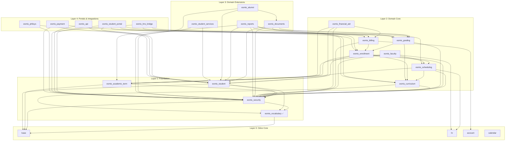

# Implementation Roadmap

Ordered implementation plan for building eSMIS modules. Each module specification includes
dependencies, models, acceptance criteria, and complexity estimates so a developer can pick
up any module and know exactly what to build.

**Last Updated:** 2026-03-09

---

## Table of Contents

1. [Module Dependency Graph](#module-dependency-graph)
2. [Implementation Phases](#implementation-phases)
3. [Minimum Viable SIS](#minimum-viable-sis)
4. [Per-Module Specifications](#per-module-specifications)
5. [Suggested Implementation Order Within Phases](#suggested-implementation-order-within-phases)
6. [Cross-Cutting Concerns](#cross-cutting-concerns)

---

## Module Dependency Graph



---

## Implementation Phases

### Phase 1: Foundation

**Goal:** Establish the data backbone — vocabularies, security infrastructure, academic
calendar, and student records. No academic operations yet, but the institution can configure
its terminology, security groups, campuses, and begin entering student profiles.

| Order | Module               | Status      | Complexity |
|-------|----------------------|-------------|------------|
| 1     | `esmis_vocabulary`   | Done        | M          |
| 2     | `esmis_security`     | Not started | XL         |
| 3     | `esmis_academic_term`| Not started | S          |
| 4     | `esmis_student`      | Not started | L          |

### Phase 2: Core Academic

**Goal:** The university can define programs and curricula, create class schedules, enroll
students in sections, and record grades. Faculty teaching loads are tracked. This is the
academic engine of the SIS.

| Order | Module             | Status      | Complexity |
|-------|--------------------|-------------|------------|
| 1     | `esmis_curriculum`  | Not started | M          |
| 2     | `esmis_scheduling`  | Not started | M          |
| 3     | `esmis_faculty`     | Not started | S          |
| 4     | `esmis_enrollment`  | Not started | XL         |
| 5     | `esmis_grading`     | Not started | L          |

### Phase 3: Core Financial

**Goal:** Tuition assessment, fee schedules, financial aid (including RA 10931 Free Tuition),
and payment tracking. Students can be financially assessed upon enrollment, discounts and
scholarships applied, and payments recorded.

| Order | Module               | Status      | Complexity |
|-------|----------------------|-------------|------------|
| 1     | `esmis_billing`      | Not started | L          |
| 2     | `esmis_financial_aid`| Not started | L          |

### Phase 4: Extended Services

**Goal:** TOR and diploma generation, HEMIS government reporting, alumni tracking, and
student services (health, counseling, discipline). The institution can produce official
documents, comply with CHED reporting requirements, and manage student welfare.

| Order | Module                  | Status      | Complexity |
|-------|-------------------------|-------------|------------|
| 1     | `esmis_documents`       | Not started | L          |
| 2     | `esmis_reports`         | Not started | L          |
| 3     | `esmis_student_services`| Not started | M          |
| 4     | `esmis_alumni`          | Not started | S          |

### Phase 5: Portals & Integrations

**Goal:** External-facing capabilities — student self-service portal, REST API for third
parties, LMS grade sync, PhilSys identity verification, and online payment gateway
integration.

| Order | Module                | Status      | Complexity |
|-------|-----------------------|-------------|------------|
| 1     | `esmis_api`           | Not started | XL         |
| 2     | `esmis_student_portal`| Not started | L          |
| 3     | `esmis_lms_bridge`    | Not started | L          |
| 4     | `esmis_philsys`       | Not started | M          |
| 5     | `esmis_payment`       | Not started | M          |

---

## Minimum Viable SIS

A **pilot deployment at a single-campus university** requires modules from Phases 1–3, plus
`esmis_documents` from Phase 4. This delivers a functional SIS that handles the core student
lifecycle from enrollment through graduation.

### Required Modules

| Module               | Phase | Why It Is Required                                       |
|----------------------|-------|----------------------------------------------------------|
| `esmis_vocabulary`   | 1     | Controlled code lists used by every other module         |
| `esmis_security`     | 1     | Security groups, ACLs, consent management, DPO workflows |
| `esmis_academic_term`| 1     | Academic year and semester definitions                   |
| `esmis_student`      | 1     | Student profiles and lifecycle states                    |
| `esmis_curriculum`   | 2     | Programs, courses, and curriculum plans                  |
| `esmis_scheduling`   | 2     | Class sections and room assignments                      |
| `esmis_enrollment`   | 2     | Student enrollment, add/drop, validation                 |
| `esmis_grading`      | 2     | Grade entry, GWA computation, academic standing          |
| `esmis_billing`      | 3     | Fee assessment and payment tracking                      |
| `esmis_documents`    | 4     | TOR generation (required for any graduating class)       |

### Optional but Recommended for Pilot

| Module               | Phase | Why It Helps                                              |
|----------------------|-------|-----------------------------------------------------------|
| `esmis_faculty`      | 2     | Teaching load tracking (can be done manually at first)    |
| `esmis_financial_aid` | 3    | Required if the HEI is a SUC (Free Tuition Law compliance)|

### What a University Can DO With the MVP

1. **Configure the institution** — set up campuses, academic years, semesters, and enrollment windows
2. **Define academic programs** — create BSCS, BSIT, etc. with curriculum plans, prerequisites, and PQF mappings
3. **Manage students** — create student profiles, track lifecycle from applicant through graduated/alumni
4. **Enroll students** — cart-based enrollment with prerequisite validation, capacity checks, and schedule conflict detection
5. **Schedule classes** — assign sections to rooms, instructors, and time slots
6. **Record grades** — faculty grade entry with component-based grading, INC resolution, grade change workflows
7. **Compute academic standing** — GWA calculation, Dean's List, probation, Latin honors
8. **Assess fees** — compute tuition based on units enrolled, apply miscellaneous fees
9. **Generate TORs** — produce official transcripts of records with digital signatures and QR verification
10. **Enforce data privacy** — consent management per RA 10173, PII access logging, breach notification workflows
11. **Multi-campus isolation** — record rules by `company_id` if the HEI has satellite campuses

---

## Per-Module Specifications

### `esmis_vocabulary` (Phase 1, Order 1) — DONE

| Attribute   | Value                                                              |
|-------------|--------------------------------------------------------------------|
| Description | Unified terminology system for controlled code lists (gender, civil status, degree types, etc.) |
| Dependencies | `base`                                                            |
| Models      | `esmis.vocabulary`, `esmis.vocabulary.code`, `esmis.vocabulary.mapping` (mapping deferred) |
| Complexity  | **M**                                                              |
| Status      | **Implemented** (v19.0.1.0.0)                                     |

**Key features:**
- Hierarchical vocabulary support (parent/child codes)
- System vs. user-editable vocabularies
- Deprecation workflow with replacement tracking
- Domain categorization (core, operations, identity, regulatory, etc.)
- Cross-vocabulary mapping (planned for future)

---

### `esmis_security` (Phase 1, Order 2)

| Attribute   | Value                                                              |
|-------------|--------------------------------------------------------------------|
| Description | Security groups, ACLs, DPO role, consent management, breach notification, data retention, approval workflows, and cross-cutting security mixins |
| Dependencies | `base`, `esmis_vocabulary`                                        |
| Complexity  | **XL**                                                             |

**Models (14):**

| Model                      | Type      | Purpose                                        |
|----------------------------|-----------|-------------------------------------------------|
| `esmis.approval.mixin`     | Abstract  | Standardized approval workflow states/methods   |
| `esmis.consent.mixin`      | Abstract  | Consent-checking methods for PII models         |
| `esmis.pii.aware`          | Abstract  | Field-level PII classification and masking      |
| `esmis.campus.aware`       | Abstract  | `company_id` + campus isolation record rules    |
| `esmis.audit.mixin`        | Abstract  | Soft delete, legal hold, retention enforcement  |
| `esmis.retention.aware`    | Abstract  | Legal hold fields for retention-subject models  |
| `esmis.audit.rule`         | Model     | Configurable audit rules per model              |
| `esmis.audit.log`          | Model     | Immutable audit trail of CRUD operations        |
| `esmis.pii.access.log`     | Model     | PII field access logging (append-only)          |
| `esmis.approval.definition`| Model     | Multi-stage approval chain definitions          |
| `esmis.consent`            | Model     | Per-student, per-purpose consent records        |
| `esmis.consent.scope`      | Model     | Fine-grained consent scope (fields, parties)    |
| `esmis.data.breach`        | Model     | Breach notification workflow (72-hr NPC SLA)    |
| `esmis.data.subject.request` | Model  | DSAR handling (30 working day SLA)              |
| `esmis.disposal.review`    | Model     | Data disposal approval workflow                 |
| `esmis.retention.schedule` | Model     | Retention periods per data category             |

**Key features:**
- Security group hierarchy: Student, Faculty, Officer, Registrar, Dean, DPO, Admin
- RA 10173 consent management with per-purpose granularity
- Breach notification workflow with 72-hour NPC deadline
- Data subject access request (DSAR) workflow with 30-day SLA
- Data retention schedules and disposal review process
- PII access logging (append-only, immutable)
- Cross-cutting mixins consumed by all domain modules

**Acceptance criteria:**
- [ ] All security groups created with correct implied_ids hierarchy
- [ ] `esmis.consent` enforces unique active consent per student+purpose
- [ ] `esmis.pii.access.log` blocks `write()` and `unlink()` on immutable fields
- [ ] `esmis.data.breach` computes `npc_deadline` as discovery_date + 72 hours
- [ ] `esmis.data.subject.request` computes deadline as receipt_date + 30 working days
- [ ] `esmis.campus.aware` mixin adds `company_id` with default and record rule
- [ ] `esmis.approval.mixin` state machine transitions enforce permission checks
- [ ] All models have complete `ir.model.access.csv` entries
- [ ] Tests cover consent creation, withdrawal, breach workflow, DSAR lifecycle
- [ ] No PII in log messages or exception text
- [ ] Demo data creates realistic security groups, consent records, and retention schedules

---

### `esmis_academic_term` (Phase 1, Order 3)

| Attribute   | Value                                                              |
|-------------|--------------------------------------------------------------------|
| Description | Academic year and term/semester definitions with enrollment windows |
| Dependencies | `base`, `esmis_security`                                          |
| Complexity  | **S**                                                              |

**Models (2):**

| Model                | Type  | Purpose                                         |
|----------------------|-------|-------------------------------------------------|
| `esmis.academic.year`| Model | Institution-wide academic year (shared)         |
| `esmis.academic.term`| Model | Campus-scoped semester with enrollment dates    |

**Key features:**
- Academic year with start/end dates and child terms
- Terms carry enrollment open/close dates and add/drop deadlines
- Term state machine: `draft` → `enrollment_open` → `in_progress` → `grading` → `closed`
- Campus-scoped terms (different campuses can have different calendars)
- Academic year is shared (no `company_id`)

**Acceptance criteria:**
- [ ] Academic year validates `date_end > date_start`
- [ ] Term validates dates fall within parent academic year
- [ ] Term state transitions enforce correct order
- [ ] Enrollment dates validated (open < close < add_drop_deadline)
- [ ] Campus-scoped terms: different campuses can have independent term dates
- [ ] Complete `ir.model.access.csv`
- [ ] Demo data creates at least one academic year with two semesters and a summer term

---

### `esmis_student` (Phase 1, Order 4)

| Attribute   | Value                                                              |
|-------------|--------------------------------------------------------------------|
| Description | Core student profile linked to `res.partner`, with lifecycle states, identifiers, and course history |
| Dependencies | `base`, `esmis_vocabulary`, `esmis_security`                      |
| Complexity  | **L**                                                              |

**Models (4):**

| Model                        | Type  | Purpose                                       |
|------------------------------|-------|-----------------------------------------------|
| `esmis.student`              | Model | Core student record with lifecycle state      |
| `esmis.student.program`      | Model | Student-program binding with GWA tracking     |
| `esmis.student.course.history`| Model | Historical record of courses taken            |
| `esmis.identifier`           | Model | Multi-type identifier store (PhilSys, LRN, TIN) |

**Key features:**
- Extends `res.partner` for student-specific fields
- Student lifecycle: `applicant` → `admitted` → `enrolled` → `active` → `graduated` → `alumni`
- Student number generation (institution-configurable format)
- Guardian tracking for minors (consent requirements)
- Multi-identifier support with encrypted storage for Tier 3 identifiers
- Academic standing tracking (good standing, Dean's List, probation, dismissed)
- Transfer tracking (in/out)

**Acceptance criteria:**
- [ ] `esmis.student` creates a linked `res.partner` or attaches to existing one
- [ ] Student state machine enforces valid transitions
- [ ] `esmis.identifier` encrypts Tier 3 values (`value_ciphertext`) and generates blind index
- [ ] Guardian is required when student is a minor (age < 18 at enrollment)
- [ ] Consent fields track who gave consent and when
- [ ] Campus isolation via `company_id` record rules
- [ ] Complete ACLs — registrar can CRUD, faculty can read, students see only their own
- [ ] No PII (names, student numbers) in log messages
- [ ] Demo data creates students across multiple lifecycle states

---

### `esmis_curriculum` (Phase 2, Order 1)

| Attribute   | Value                                                              |
|-------------|--------------------------------------------------------------------|
| Description | Programs, colleges, courses, curriculum versions, prerequisites, and PQF mappings |
| Dependencies | `esmis_vocabulary`, `esmis_security`                              |
| Complexity  | **M**                                                              |

**Models (5):**

| Model               | Type  | Purpose                                          |
|---------------------|-------|--------------------------------------------------|
| `esmis.program`     | Model | CHED-recognized academic program                 |
| `esmis.college`     | Model | Organizational unit (college/department)         |
| `esmis.course`      | Model | Individual course with prerequisites             |
| `esmis.curriculum`  | Model | Versioned curriculum plan for a program          |
| `esmis.pqf.mapping` | Model | Program-to-PQF level qualification mapping       |

**Key features:**
- Programs carry CHED program codes and degree types (via vocabulary codes)
- Curriculum versioning — students bind to a specific curriculum version
- Prerequisite and corequisite chains on courses
- PQF level mapping (levels 1–8) for CHED compliance
- College/department hierarchy per campus
- Programs are shared (institution-level); colleges can be campus-scoped

**Acceptance criteria:**
- [ ] Prerequisite chains do not allow circular dependencies
- [ ] Curriculum `total_units` matches sum of course units (or is manually overridable)
- [ ] PQF mapping validates level range (1–8)
- [ ] Programs reference vocabulary codes for degree type
- [ ] Complete ACLs — registrar/dean can CRUD, faculty/students read-only
- [ ] Demo data: at least 2 programs (e.g., BSCS, BSIT) with full curriculum plans

---

### `esmis_scheduling` (Phase 2, Order 2)

| Attribute   | Value                                                              |
|-------------|--------------------------------------------------------------------|
| Description | Class sections, room assignments, schedule slots, and conflict detection |
| Dependencies | `esmis_academic_term`, `esmis_curriculum`, `esmis_security`, `hr`  |
| Complexity  | **M**                                                              |

**Models (2):**

| Model          | Type  | Purpose                                            |
|----------------|-------|----------------------------------------------------|
| `esmis.section` | Model | Class section (course + term + room + instructor) |
| `esmis.room`   | Model | Physical room with capacity                        |

**Key features:**
- Sections link courses to terms, rooms, and faculty
- Learning modality selection (face-to-face, online, blended, asynchronous)
- Capacity tracking with computed enrolled count
- Schedule conflict detection (room and instructor)
- Grading system override per section (inherits from program by default)
- Campus-scoped via `company_id`

**Acceptance criteria:**
- [ ] Schedule conflict detection blocks double-booking of rooms and instructors
- [ ] `enrolled_count` computed field accurately reflects confirmed enrollment lines
- [ ] Capacity enforcement prevents over-enrollment
- [ ] Section references valid course, term, and campus
- [ ] Complete ACLs — registrar can CRUD, faculty can view their sections
- [ ] Demo data: sections with schedule slots, rooms assigned

---

### `esmis_faculty` (Phase 2, Order 3)

| Attribute   | Value                                                              |
|-------------|--------------------------------------------------------------------|
| Description | Faculty profiles (via `hr.employee`) and teaching load management  |
| Dependencies | `hr`, `esmis_scheduling`, `esmis_academic_term`, `esmis_security` |
| Complexity  | **S**                                                              |

**Models (1):**

| Model               | Type  | Purpose                                       |
|---------------------|-------|-----------------------------------------------|
| `esmis.faculty.load` | Model | Per-term teaching load summary for a faculty member |

**Key features:**
- Extends `hr.employee` for faculty-specific fields (no separate faculty model)
- Teaching load computed from assigned sections per term
- Total units computed field
- Campus-scoped load records

**Acceptance criteria:**
- [ ] `total_units` correctly sums units from assigned sections
- [ ] Faculty can view their own load; deans can view department loads
- [ ] Campus isolation via `company_id`
- [ ] Complete ACLs
- [ ] Demo data: faculty members with section assignments and computed loads

---

### `esmis_enrollment` (Phase 2, Order 4)

| Attribute   | Value                                                              |
|-------------|--------------------------------------------------------------------|
| Description | Full enrollment lifecycle: admissions, cart-based enrollment, validation, add/drop, cross-enrollment, credit transfer, holds |
| Dependencies | `esmis_student`, `esmis_curriculum`, `esmis_academic_term`, `esmis_scheduling`, `esmis_security` |
| Complexity  | **XL**                                                             |

**Models (9):**

| Model                           | Type  | Purpose                                      |
|---------------------------------|-------|----------------------------------------------|
| `esmis.applicant`               | Model | Admissions applicant record                  |
| `esmis.admission.decision`      | Model | Admission evaluation and decision            |
| `esmis.enrollment`              | Model | Per-term enrollment header                   |
| `esmis.enrollment.line`         | Model | Individual course selection within enrollment|
| `esmis.enrollment.change`       | Model | Add/drop change log                          |
| `esmis.enrollment.hold`         | Model | Financial/disciplinary/library holds         |
| `esmis.enrollment.window`       | Model | Priority-based enrollment windows            |
| `esmis.cross.enrollment.permit` | Model | Cross-campus enrollment authorization        |
| `esmis.credit.transfer`         | Model | Inter-campus credit transfer evaluation      |

**Key features:**
- Admissions workflow: application → evaluation → admitted/waitlisted/denied
- Cart-based enrollment: select sections → validate → assess → pay → enrolled
- Prerequisite validation before enrollment confirmation
- Schedule conflict detection across selected sections
- Priority enrollment windows (PWD/solo parent first, then by year level)
- Add/drop with refund computation based on institutional policy
- Enrollment holds (financial, disciplinary, library, registrar)
- Cross-campus enrollment with permit workflow
- Credit transfer evaluation between campuses
- PhilSys verification fields on applicant
- Consent capture at application time

**Acceptance criteria:**
- [ ] Enrollment state machine enforces valid transitions
- [ ] Prerequisite validation blocks enrollment in courses without met prerequisites
- [ ] Schedule conflict detection prevents overlapping sections
- [ ] Enrollment windows enforce priority group ordering
- [ ] Holds block enrollment progression (student cannot proceed past `hold` state)
- [ ] Cross-enrollment permit workflow: draft → approved → used → expired
- [ ] Credit transfer evaluation: draft → evaluated → approved/rejected
- [ ] Add/drop computes refund amount based on campus refund policy
- [ ] Consent is captured for applicants (minor consent when age < 18)
- [ ] Campus isolation via `company_id`
- [ ] Complete ACLs for all 9 models
- [ ] Demo data: applicants at various stages, enrolled students, holds, add/drop records

---

### `esmis_grading` (Phase 2, Order 5)

| Attribute   | Value                                                              |
|-------------|--------------------------------------------------------------------|
| Description | Grade entry, component-based grading, GWA computation, grade changes, academic standing, and Latin honors |
| Dependencies | `esmis_enrollment`, `esmis_curriculum`, `esmis_security`          |
| Complexity  | **L**                                                              |

**Models (8):**

| Model                           | Type  | Purpose                                     |
|---------------------------------|-------|---------------------------------------------|
| `esmis.grading.system`          | Model | Grading scale definition (1.0–5.0, etc.)   |
| `esmis.grading.scale`           | Model | Individual grade values within a system     |
| `esmis.grade.component.template`| Model | Reusable grading component weights          |
| `esmis.grade`                   | Model | Individual student grade record (SPI)       |
| `esmis.grade.component`         | Model | Component scores (midterm, final, etc.)     |
| `esmis.grade.change`            | Model | Grade change request workflow               |
| `esmis.standing.policy`         | Model | Program-level academic standing thresholds  |
| `esmis.latin.honors.config`     | Model | Latin honors GWA thresholds                 |

**Key features:**
- Configurable grading systems (Philippine 1.0–5.0, 4.0 GPA, letter grades)
- Component-based grading with weights (midterm, final, project, etc.)
- INC (Incomplete) grade with resolution deadline and workflow
- Grade change request: faculty → dean review → registrar apply → locked
- GWA computation (weighted by units, configurable for ascending/descending scales)
- Academic standing computation based on program-level policies
- Latin honors determination (Cum Laude, Magna Cum Laude, Summa Cum Laude)
- Grades are **Sensitive Personal Information (SPI)** — field-level access control required
- LMS grade source tracking (`manual` vs `lms`)

**Acceptance criteria:**
- [ ] Grade state machine: `draft` → `submitted` → `approved` → `locked`
- [ ] Only the assigned faculty can submit grades for their sections
- [ ] Grade change workflow enforces dean → registrar approval chain
- [ ] INC resolution deadline is enforced; unresolved INC auto-converts per policy
- [ ] GWA computation handles both ascending-is-worse and ascending-is-better scales
- [ ] Academic standing computed correctly against program-specific thresholds
- [ ] Latin honors determined at graduation based on cumulative GWA
- [ ] Grades treated as SPI — read access logged, no public exposure
- [ ] Complete ACLs: faculty submit, registrar approve, students view own grades only
- [ ] Demo data: grades across multiple students, sections, and states

---

### `esmis_billing` (Phase 3, Order 1)

| Attribute   | Value                                                              |
|-------------|--------------------------------------------------------------------|
| Description | Fee schedules, financial assessment per enrollment, and Odoo accounting integration |
| Dependencies | `esmis_enrollment`, `account`, `esmis_security`                   |
| Complexity  | **L**                                                              |

**Models (2):**

| Model                       | Type  | Purpose                                       |
|-----------------------------|-------|-----------------------------------------------|
| `esmis.fee.schedule`        | Model | Per-campus, per-term fee configuration        |
| `esmis.financial.assessment`| Model | Computed tuition assessment per enrollment    |

**Key features:**
- Fee schedules with rate-per-unit and miscellaneous fee lines
- Financial assessment computed from enrollment (units × rate + misc fees)
- Discount application (from financial aid awards)
- Integration with Odoo `account` module for invoice generation
- Assessment state machine: `draft` → `computed` → `locked`
- Campus-scoped fee schedules (different campuses can have different rates)

**Acceptance criteria:**
- [ ] Fee schedule correctly computes base tuition from enrolled units
- [ ] Miscellaneous fees added to assessment
- [ ] Discount amounts applied from linked financial aid awards
- [ ] Net amount = base tuition + misc fees - discounts
- [ ] Assessment locks when enrollment is finalized
- [ ] Integration with `account.move` for invoice generation
- [ ] Campus-scoped fee schedules
- [ ] Complete ACLs — finance officer can CRUD, students view own assessment
- [ ] Demo data: fee schedules and computed assessments

---

### `esmis_financial_aid` (Phase 3, Order 2)

| Attribute   | Value                                                              |
|-------------|--------------------------------------------------------------------|
| Description | Financial aid programs, eligibility evaluation, award lifecycle, and discount stacking |
| Dependencies | `esmis_student`, `esmis_billing`, `esmis_academic_term`, `esmis_security` |
| Complexity  | **L**                                                              |

**Models (3):**

| Model                            | Type  | Purpose                                     |
|----------------------------------|-------|---------------------------------------------|
| `esmis.financial.aid.program`    | Model | Aid program definition with eligibility rules |
| `esmis.financial.aid.award`      | Model | Per-student, per-term award record          |
| `esmis.financial.aid.application`| Model | Student application for financial aid       |

**Key features:**
- Program types: government (TES, DOST-SEI), institutional, external, statutory discount (PWD, solo parent)
- Eligibility rules via Odoo domain expressions
- Award lifecycle: `draft` → `evaluated` → `approved` → `disbursed` → `completed`
- Discount stacking policies: stackable, exclusive, capped
- Application order determines stacking sequence
- Free Tuition (RA 10931) takes precedence — applied first
- Renewal criteria for multi-term awards
- Philippine-specific data files for government programs

**Acceptance criteria:**
- [ ] Free Tuition eligibility evaluated before other aid programs
- [ ] Stacking policy enforced: exclusive programs block others; capped programs respect max
- [ ] Application order determines discount sequence
- [ ] Renewal criteria automatically evaluated each term
- [ ] Award amount correctly reduces financial assessment
- [ ] Edge cases tested: PWD + solo parent stacking, transferee with prior degree
- [ ] Complete ACLs — financial aid officer manages, students view own awards
- [ ] Demo data: TES, institutional scholarship, PWD discount with sample awards

---

### `esmis_documents` (Phase 4, Order 1)

| Attribute   | Value                                                              |
|-------------|--------------------------------------------------------------------|
| Description | Official document generation (TOR, diploma, certifications), graduation workflow, clearance, digital signatures, and QR verification |
| Dependencies | `esmis_student`, `esmis_grading`, `esmis_curriculum`, `esmis_security` |
| Complexity  | **L**                                                              |

**Models (7):**

| Model                     | Type  | Purpose                                        |
|---------------------------|-------|------------------------------------------------|
| `esmis.document`          | Model | Generated official document with QR token      |
| `esmis.document.request`  | Model | Student request for document issuance          |
| `esmis.digital.signature` | Model | Authorized signer configuration                |
| `esmis.graduation`        | Model | Graduation candidacy and completion            |
| `esmis.graduation.policy` | Model | Program-level graduation requirements          |
| `esmis.clearance`         | Model | Multi-office clearance header                  |
| `esmis.clearance.line`    | Model | Per-office clearance status                    |

**Key features:**
- TOR generation from grade records with digital signature and QR verification
- Diploma generation linked to graduation record
- Clearance workflow: all offices must clear before graduation
- Graduation candidacy: validates all curriculum requirements met
- Latin honors applied from `esmis.latin.honors.config`
- CHED Special Order number tracking
- Document request workflow: submitted → processing → ready → released
- QR verification tokens for document authenticity

**Acceptance criteria:**
- [ ] TOR accurately reflects all grades from `esmis.grade` records
- [ ] Graduation validates curriculum completion (all required courses passed, total units met)
- [ ] Clearance requires all offices (library, finance, registrar, department, student affairs)
- [ ] Latin honors correctly applied based on configuration
- [ ] Document QR tokens are unique and verifiable
- [ ] Digital signatures linked to authorized users
- [ ] Document request tracks payment requirement
- [ ] Complete ACLs — registrar generates, students request and view own documents
- [ ] Demo data: graduated students with TOR and diploma records

---

### `esmis_reports` (Phase 4, Order 2)

| Attribute   | Value                                                              |
|-------------|--------------------------------------------------------------------|
| Description | HEMIS export wizards, accreditation evidence packages, and reporting dashboards |
| Dependencies | `esmis_student`, `esmis_enrollment`, `esmis_grading`, `esmis_curriculum`, `esmis_academic_term`, `esmis_security` |
| Complexity  | **L**                                                              |

**Models (1):**

| Model                        | Type           | Purpose                              |
|------------------------------|----------------|--------------------------------------|
| `esmis.hemis.export.wizard`  | TransientModel | CHED HEMIS annual export wizard      |

**Key features:**
- CHED HEMIS export wizard generating Excel files matching CHED field specifications
- Institution type selection (SUC, private, LUC)
- Campus-level or institution-wide export
- Accreditation evidence reports: grade distribution, retention rates, faculty qualifications
- Enrollment and graduation rate reports across academic years
- Program outcome achievement summaries linked to PQF levels

**Acceptance criteria:**
- [ ] HEMIS export produces Excel files matching CHED-specified column formats
- [ ] Export validates required fields, data types, and value ranges before generation
- [ ] Reports correctly consolidate multi-campus data without double-counting
- [ ] Consent is verified before including student PII in exports
- [ ] Accreditation reports include grade distribution and retention trends
- [ ] Complete ACLs — only authorized officers (registrar, planning) can run exports
- [ ] Tests validate export format against CHED specifications

---

### `esmis_student_services` (Phase 4, Order 3)

| Attribute   | Value                                                              |
|-------------|--------------------------------------------------------------------|
| Description | Student health records, counseling notes, and disciplinary records  |
| Dependencies | `esmis_student`, `esmis_security`                                 |
| Complexity  | **M**                                                              |

**Models (3):**

| Model                       | Type  | Purpose                                       |
|-----------------------------|-------|-----------------------------------------------|
| `esmis.health.record`       | Model | Student health and disability records (Tier 3)|
| `esmis.counseling.note`     | Model | Confidential counseling session notes (Tier 3)|
| `esmis.disciplinary.record` | Model | Disciplinary violations and sanctions         |

**Key features:**
- Health records include PWD classification and medical notes (Tier 3 / SPI)
- Counseling notes are Restricted — only the assigned counselor and DPO can access
- Disciplinary records with state machine: `open` → `resolved` → `dismissed`
- All models contain SPI — MFA consideration for access, field-level encryption
- Campus-scoped disciplinary records

**Acceptance criteria:**
- [ ] Health records and counseling notes classified as Tier 3 (SPI)
- [ ] Counseling notes restricted to assigned counselor — not visible to registrar or faculty
- [ ] PII access logging enabled for all reads of SPI fields
- [ ] Disciplinary state machine enforces valid transitions
- [ ] Campus isolation for disciplinary records
- [ ] Complete ACLs with field-level access for SPI fields
- [ ] Consent required for health record processing
- [ ] Demo data uses fictional records (no real PII)

---

### `esmis_alumni` (Phase 4, Order 4)

| Attribute   | Value                                                              |
|-------------|--------------------------------------------------------------------|
| Description | Alumni lifecycle transition, tracer studies, and alumni directory   |
| Dependencies | `esmis_student`, `esmis_documents`, `esmis_security`              |
| Complexity  | **S**                                                              |

**Models (1):**

| Model                   | Type  | Purpose                                         |
|-------------------------|-------|-------------------------------------------------|
| `esmis.tracer.response` | Model | Graduate tracer study survey response           |

**Key features:**
- Student state transition to `alumni` after graduation
- Tracer study data collection (employment status, time to first job, relevance)
- Requires separate alumni-tracking consent (per RA 10173)
- Supports accreditation reporting on graduate outcomes

**Acceptance criteria:**
- [ ] Tracer response linked to graduated student records
- [ ] Alumni-specific consent (`consent_alumni_tracking`) required before data collection
- [ ] Employment tracking fields validated
- [ ] Reports on graduate outcomes by program
- [ ] Complete ACLs — alumni office can CRUD, students can submit their own responses
- [ ] Demo data: tracer responses for sample graduates

---

### `esmis_api` (Phase 5, Order 1)

| Attribute   | Value                                                              |
|-------------|--------------------------------------------------------------------|
| Description | REST API facade with OAuth 2.0, stable identifiers (no DB IDs), API client management, and audit logging |
| Dependencies | `esmis_security`, `esmis_student`                                 |
| Complexity  | **XL**                                                             |

**Models (5):**

| Model                    | Type  | Purpose                                         |
|--------------------------|-------|-------------------------------------------------|
| `esmis.api.client`       | Model | OAuth 2.0 API client registration              |
| `esmis.api.client.scope` | Model | Per-client authorized scopes                    |
| `esmis.api.audit.log`    | Model | API request audit trail                         |
| `esmis.api.extension`    | Model | Module-contributed API field extensions          |
| `esmis.api.path`         | Model | API endpoint path definitions                   |

**Key features:**
- OAuth 2.0 client credentials flow
- Scrypt-hashed client secrets
- Per-client scope authorization (resource + action + consent flag)
- Stable identifier enforcement — never expose DB IDs
- API audit logging (request ID, IP, operation, resource, status)
- Extensible API schema via module-contributed extensions
- Consent verification for PII-containing responses

**Acceptance criteria:**
- [ ] OAuth 2.0 token issuance and validation
- [ ] Client secret stored as scrypt hash — never in plaintext
- [ ] Scope enforcement blocks unauthorized resource/action combinations
- [ ] All API responses use stable identifiers (`esmis.identifier`), never DB IDs
- [ ] API audit log captures every request with correlation ID
- [ ] Consent checked before returning PII fields
- [ ] Rate limiting per client
- [ ] Complete ACLs — only admin manages API clients
- [ ] Integration tests against actual HTTP endpoints

---

### `esmis_student_portal` (Phase 5, Order 2)

| Attribute   | Value                                                              |
|-------------|--------------------------------------------------------------------|
| Description | Student self-service portal for enrollment, grades, and document requests |
| Dependencies | `esmis_student`, `esmis_enrollment`, `esmis_grading`, `esmis_billing`, `esmis_security` |
| Complexity  | **L**                                                              |

**Models:** None (portal controllers and templates only — extends Odoo website/portal)

**Key features:**
- Student login via Odoo portal
- View enrollment status and enrolled courses
- View grades (own grades only — SPI access controls)
- View financial assessment and payment status
- Submit document requests
- Update personal information (with consent tracking)
- Consent management self-service

**Acceptance criteria:**
- [ ] Students can only see their own records — no cross-student data leakage
- [ ] Grade display respects SPI classification
- [ ] Document request submission creates `esmis.document.request` records
- [ ] Personal information updates logged in PII access log
- [ ] Portal works on mobile devices (responsive)
- [ ] Tests cover access control boundaries (student A cannot see student B data)

---

### `esmis_lms_bridge` (Phase 5, Order 3)

| Attribute   | Value                                                              |
|-------------|--------------------------------------------------------------------|
| Description | LMS integration via LTI 1.3 and OneRoster 1.2 for roster sync and grade passback |
| Dependencies | `esmis_scheduling`, `esmis_grading`, `esmis_security`             |
| Complexity  | **L**                                                              |

**Models (1):**

| Model                | Type  | Purpose                                          |
|----------------------|-------|--------------------------------------------------|
| `esmis.lms.platform` | Model | LMS connection configuration per campus          |

**Key features:**
- LTI 1.3 launch and deep linking
- OneRoster 1.2 roster sync (student enrollment → LMS course membership)
- Grade passback from LMS to `esmis.grade` (source = `lms`)
- Delta sync via cursor-based pagination
- Per-campus LMS configuration (different campuses can use different LMS platforms)
- RSA key pair management for LTI 1.3 message signing

**Acceptance criteria:**
- [ ] LTI 1.3 launch flow works with Moodle and Canvas
- [ ] OneRoster roster sync creates/updates LMS course membership
- [ ] Grade passback creates `esmis.grade` records with `source='lms'`
- [ ] Delta sync handles incremental updates correctly
- [ ] LMS credentials stored securely (encrypted)
- [ ] Campus-scoped platform configuration
- [ ] Complete ACLs — only admin configures LMS platforms
- [ ] Tests cover sync flow with mock LMS responses

---

### `esmis_philsys` (Phase 5, Order 4)

| Attribute   | Value                                                              |
|-------------|--------------------------------------------------------------------|
| Description | Philippine National ID (PhilSys) verification via QR scan and eVerify API |
| Dependencies | `esmis_student`, `esmis_security`                                 |
| Complexity  | **M**                                                              |

**Models (1):**

| Model                        | Type  | Purpose                                     |
|------------------------------|-------|---------------------------------------------|
| `esmis.philsys.verification` | Model | Verification attempt record with result     |

**Key features:**
- QR code scan verification (offline, parses PhilSys QR data)
- eVerify API integration (online, calls PSA eVerify endpoint)
- Verification linked to consent record (PhilSys-specific consent)
- Result tracking: pass, fail, pending
- Operator tracking for audit trail

**Acceptance criteria:**
- [ ] QR verification parses PhilSys QR format correctly
- [ ] eVerify API call handles success, failure, and timeout
- [ ] PhilSys-specific consent (`consent_philsys`) required before verification
- [ ] Verification result stored immutably
- [ ] PhilSys Number (PSN) classified as Tier 3 — encrypted at rest
- [ ] Complete ACLs — only authorized operators can perform verifications
- [ ] Tests cover both QR and eVerify flows (with mock API)

---

### `esmis_payment` (Phase 5, Order 5)

| Attribute   | Value                                                              |
|-------------|--------------------------------------------------------------------|
| Description | Payment gateway integration for online tuition collection via PayMongo, Maya, and Dragonpay |
| Dependencies | `esmis_billing`, `esmis_security`                                 |
| Complexity  | **M**                                                              |

**Models (2):**

| Model                 | Type  | Purpose                                          |
|-----------------------|-------|--------------------------------------------------|
| `esmis.payment`       | Model | Payment record linked to enrollment              |
| `esmis.payment.event` | Model | Raw webhook event log from payment gateways      |

**Key features:**
- Multi-gateway support: PayMongo, Maya, Dragonpay, over-the-counter
- Webhook receiver for payment confirmation/failure/refund events
- Payment state machine: `pending` → `confirmed` / `failed` / `refunded`
- Gateway reference tracking for reconciliation
- Raw webhook payload storage for audit
- Bank account number classified as Tier 3 — encrypted at rest

**Acceptance criteria:**
- [ ] Payment creation linked to enrollment and financial assessment
- [ ] Webhook receiver validates gateway signatures
- [ ] Payment state transitions match gateway event types
- [ ] Refund workflow updates both payment and financial assessment
- [ ] Bank account numbers encrypted at rest
- [ ] Webhook payloads stored immutably for audit
- [ ] Complete ACLs — finance officer manages, students view own payments
- [ ] Tests cover webhook processing with mock gateway payloads

---

## Suggested Implementation Order Within Phases

### Phase 1: Foundation

```
1. esmis_vocabulary     ← DONE. Base vocabulary system.
2. esmis_security       ← Must come next. Every other module depends on its mixins
                          and security groups. Largest single module.
3. esmis_academic_term  ← Small, independent of student. Needed by enrollment/scheduling.
4. esmis_student        ← Depends on vocabulary and security. Core entity for everything.
```

**Rationale:** Security must come before student because `esmis.student` inherits
`esmis.campus.aware`, `esmis.pii.aware`, and `esmis.consent.mixin` from `esmis_security`.
Academic term is independent of student and can be built in parallel if needed.

### Phase 2: Core Academic

```
1. esmis_curriculum     ← No dependency on student or term. Pure academic catalog.
2. esmis_scheduling     ← Depends on curriculum (courses) and term. Creates sections.
3. esmis_faculty        ← Depends on scheduling (sections) and term. Small module.
4. esmis_enrollment     ← Depends on student, curriculum, term, scheduling. Largest module.
5. esmis_grading        ← Depends on enrollment. Cannot grade without enrolled students.
```

**Rationale:** Curriculum defines what can be taught. Scheduling creates the sections.
Faculty assigns teachers to sections. Enrollment puts students in sections. Grading
evaluates enrolled students. This is the natural academic workflow sequence.

### Phase 3: Core Financial

```
1. esmis_billing        ← Depends on enrollment. Assessment happens at enrollment time.
2. esmis_financial_aid  ← Depends on billing (modifies assessment amounts).
```

**Rationale:** Billing must exist before financial aid can reduce the assessment.

### Phase 4: Extended Services

```
1. esmis_documents       ← Depends on grading (TOR) and student. Needed for graduation.
2. esmis_reports         ← Depends on most Layer 2 modules. HEMIS export is a priority.
3. esmis_student_services← Independent of documents/reports. Health, counseling, discipline.
4. esmis_alumni          ← Depends on documents (graduation records). Last in sequence.
```

**Rationale:** Documents (especially TOR) are needed as soon as the first cohort completes
a semester. Reports follow because HEMIS is an annual regulatory requirement. Student
services and alumni are independent of each other and can be built in any order.

### Phase 5: Portals & Integrations

```
1. esmis_api             ← API facade must exist before external integrations consume it.
2. esmis_student_portal  ← Student self-service. High user impact.
3. esmis_lms_bridge      ← Grade sync. Depends on grading and scheduling.
4. esmis_philsys         ← Identity verification. Can integrate incrementally.
5. esmis_payment         ← Online payment. Depends on billing.
```

**Rationale:** The API layer establishes patterns that portal and integrations consume.
Student portal has the highest user impact. LMS bridge, PhilSys, and payment are
independent of each other and can be built in parallel.

---

## Cross-Cutting Concerns

These requirements apply to **every module** and must be addressed during implementation,
not deferred.

### 1. PII Classification

Every model that stores personal data must:
- Inherit `esmis.pii.aware` mixin
- Classify fields by tier (Tier 1: general PII, Tier 2: sensitive PII, Tier 3: restricted/SPI)
- Apply field-level access groups for Tier 2 and Tier 3 fields
- Never log PII values — log record IDs instead

### 2. Consent Management

Every model that processes student PII for a consent-required purpose must:
- Inherit `esmis.consent.mixin`
- Check for active consent before processing (read, export, share)
- Support per-purpose consent (enrollment ≠ alumni tracking ≠ research)
- Handle minor consent (parental consent required for students under 18)

### 3. Audit Trail

Every model that creates, updates, or deletes records must:
- Inherit `mail.thread` for Odoo chatter tracking
- Inherit `esmis.audit.mixin` for soft delete and legal hold support
- Never use `unlink()` for records subject to retention — use archival

### 4. Multi-Campus Isolation

Every transactional model must:
- Inherit `esmis.campus.aware` to add `company_id` with record rules
- Test that users on Campus A cannot see/modify Campus B records
- Shared reference data (programs, courses, grading systems) must NOT have campus isolation

### 5. Access Control

Every module must:
- Include a complete `ir.model.access.csv` covering all models in the module
- Define access for each security group (student, faculty, officer, registrar, dean, DPO, admin)
- Test ACLs by running operations as non-admin users
- Related child models need ACLs too (e.g., `esmis.enrollment.line` alongside `esmis.enrollment`)

### 6. Testing

Every module must include:
- **Unit tests** — model logic, computed fields, constraints
- **Integration tests** — cross-model workflows (e.g., enrollment → assessment → payment)
- **Access control tests** — verify ACLs by user role (not just admin)
- **Demo data tests** — verify demo records created without errors
- **Consent tests** — verify PII access requires active consent
- **Multi-campus tests** — verify record rule isolation

Test commands:
```bash
./esmis test <module_name>
./esmis test <module_name> --tags=post_install
```

### 7. Demo Data

Every module must provide demo data that:
- Creates complete, consistent records (all required relations exist)
- Uses `with_context(tracking_disable=True)` to avoid notification spam
- Covers multiple states of state machines (not just the initial state)
- Uses realistic but fictional data (no real student names, IDs, or grades)

### 8. Regulatory Compliance

| Regulation | Requirement | Affected Modules |
|------------|-------------|-----------------|
| RA 10173 (Data Privacy) | Consent, breach notification, DSAR, retention | All modules with student PII |
| CHED MORPHE (CMO 40) | Student records format, grading rules | `esmis_student`, `esmis_grading`, `esmis_documents` |
| RA 10931 (Free Tuition) | Citizenship verification, subsidy reporting | `esmis_financial_aid`, `esmis_enrollment` |
| RA 7277/10754 (PWD) | 20% discount, accessibility | `esmis_financial_aid`, `esmis_enrollment` |
| RA 8972/11861 (Solo Parent) | Scholarship eligibility | `esmis_financial_aid` |
| RA 10968 (PQF Act) | Program-to-qualification mapping | `esmis_curriculum` |

---

## Related Documents

- [Data Model Registry](data-model-registry.md) — all 81 models with field specifications
- [Architecture Vision](vision.md) — guiding principles and module map
- [Integration Patterns](integration-patterns.md) — Odoo module integration approach
- [Module Architecture](../principles/module-architecture.md) — module structure conventions
